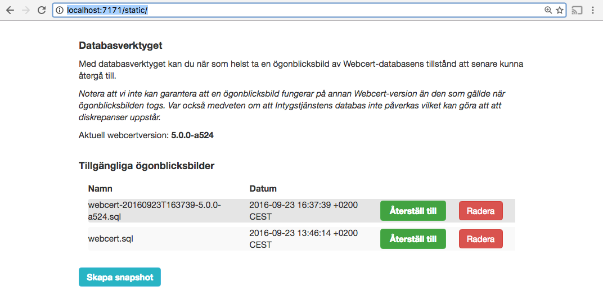

# Webcert DB tool

### Vad är detta?
Webcert DB tool (wdt) är ett enkelt verktyg för att mha _mysqldump_ och _mysql_ ta och återställa "ögonblicksbilder" (aka snapshots) av en given databas.

### Bygga
wdt är byggt i golang(https://golang.org/) och dess källkod återfinns under /tools/dbtool.

#### Bygga binär
_(Instruktioner för Linux/OS X nedan)_
För att bygga wdt från källkod eller köra lokalt så behöver man installera Go SDK 1.7+ och sedan bygga enligt följande mönster:

1. Gå till /tools/dbtool (detta är rotbiblioteket för wdt) och sätt som GOPATH
    
    export GOPATH=[absolut sökväg till aktuell katalog]    

2. Hämta dependencies
    
    cd src/github.com/sklintyg/dbtool
    go get
    cd ../../../..

3. Sätt miljövariabler för vilken miljö du vill bygga till, bygg och återställ:

    export GOARCH=amd64
    export GOOS=linux
    go build -o bin/dbtool src/github.com/sklintyg/dbtool/*.go
    export GOARCH=amd64
    export GOOS=darwin
    
I exemplet ovan byter jag mål-OS till "linux", bygger och ändrar sedan tillbaka till "darwin" (OS X). För Windowsanvändare, ändra till "windows" istället för "darwin".
Samtliga målarkitekturer och operativsystem finns listade här: https://github.com/golang/go/blob/master/src/go/build/syslist.go

(Jag ser det som osannolikt att vi kommer köra mot annat än amd64)

Binären finns nu i /bin

Det finns även ett bash-script som bygger för amd64/linux, paketerar en release-zip och kopierar den till ../ansible/roles/dbtool/templates

    ./buildanddeploy.sh
   
Scriptet ändrar tillbaka till 'darwin' så om man kör linux får man justera lite lokalt.
    
4. Klart!

Vill man köra lokalt räcker steg 1. och steg 2. ovan. Efter detta kan man köra:

    go run src/github.com/skilintyg/dbtool/*.go

### Konfiguration
På målmiljön, öppna _preferences.yml_ som skall ligga bredvid binären (eller i rotbiblioteket för dbtool om man kör lokalt):

    ---
    port: 7171
    snapshots_dir: /opt/inera/dbtool/dumps
    version_file: /opt/inera/tomcat7/version.txt
    username: username        # change!
    password: password        # change!
    db_username: webcert-db-username
    db_password: webcert-db-password
    db2_username: intyg-db-username
    db2_password: intyg-db-password
      
- Port för tjänsten
- Korrigera om nödvändigt sökvägarna till /dumps-mappen samt version.txt.
- Username / password är för HTTP Basic skydd av verktygets GUI samt API:er.
- db_username / db_password är användarnamn och lösenord till Webcert-databasen

### Apache-konfiguration
För att köra på en typisk testmiljö för Webcert behöver man korrigera /etc/httpd/conf.d/webcert.conf

    <VirtualHost *:80>
        ServerAdmin webmaster@intygspoc.inera.nordicmedtest.se
        ServerName intygspoc.inera.nordicmedtest.se
        ProxyPreserveHost On
        ProxyPass /dbtool/ http://127.0.0.1:7171/         # Lägg till!
        ProxyPassReverse /dbtool/ http://127.0.0.1:7171/  # Lägg till!
        ProxyPass / http://127.0.0.1:8181/
        ProxyPassReverse / http://127.0.0.1:8181/ 
        ProxyRequests Off
        ProxyVia Off
    </VirtualHost>

Starta om apache:

    sudo apachectl restart

### GUI-användning

wdt kör genom ett minimalistiskt GUI lokalt på default: http://localhost:7171/static/index.html
Labbmiljön (intygspoc): https://intygspoc.inera.nordicmedtest.se/dbtool/static/

)

