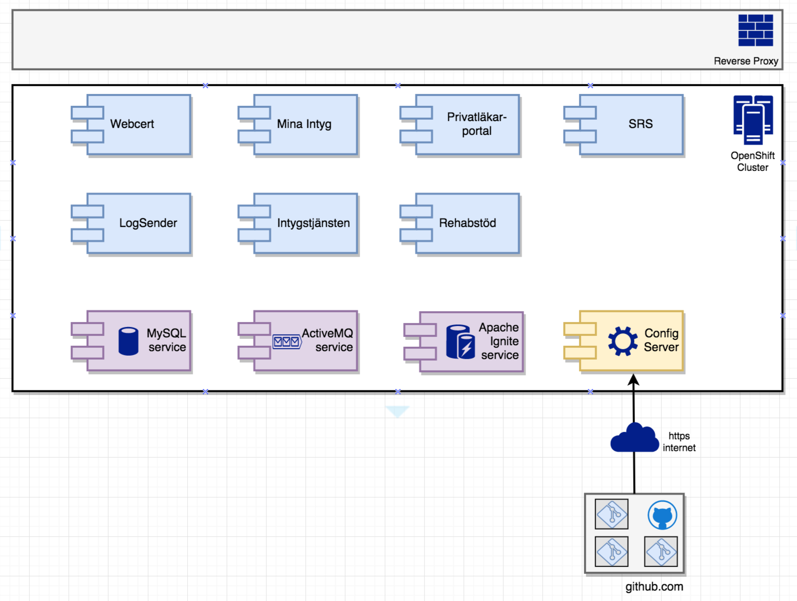
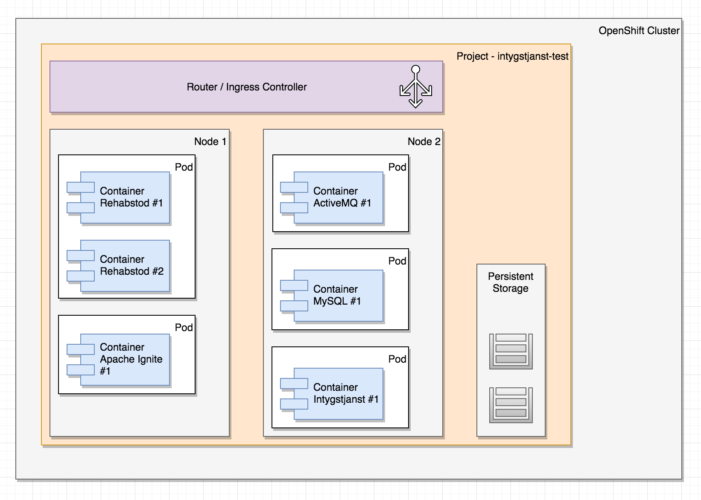

# OpenShift / Intygstjänster
For Intygstjänster 2018 we are evaluating deployment of our applications on an OpenShift cluster. This document provides som work-in-progress thoughts and findings on the topic.

### Overview
Work-in-progress conceptual overview of an OpenShift cluster for test purposes running our applications and supporting services:

Each container should only container web server + .war file and any static resources needed to execute. A container image should be runnable from local dev environment to production, i.e. all environment specifics such as configuration properties, certificates, SAML-metadata, logback-files, dynamic text resources etc must be injected or mounted at runtime.

### OpenShift anatomy
Openshift is a PaaS (Platform as a Service) built on top of the CaaS (Container orchestration as a Service) Kubernetes (K8S). OpenShift and K8S introduces a number of abstractions on top of traditional containers to provide orchestration, routing, resilience, configuration etc.
 

- A cluster is backed by one or more **nodes**. A _node_ is a physical or virtualized OS running a OpenShift master or worker. As developers, we should _never_ have to concern ourselves with actual nodes, this is something NMT or BF will provide and configure for us.
- A cluster always backs at least one **project**. A _project_ is typically declared for a number of related applications and their services in a given environment and provides the basis for multi-tenancy in OpenShift. In intygstjänster, we'll typically declare a _project_ for an environment running our applications such as:
    - test
    - demo
     - perf
     - qa
     - staging
     - prod
- Inside a _project_ we can deploy our applications as declared by a **deployment configuration**, typically defining a _container image_ for the application we want to deploy, number of replicas, ports to expose etc.
- A launched _deployment configuration_ will create a **pod** that may run one or more **containers** for the given _container image_.
- If we want our container(s) within a _pod_ to be visible _within_ the cluster, we need to define a **service** that provides an internal DNS name so our applications can talk to each other. The _service_ abstraction provides internal load-balancing, e.g. if we have one _pod_ running three instances of the _intygstjanst_ container image, requests for the logical service name "intygstjanst" will be load-balanced automatically amongst the three instances.
- If we want a _service_ (for example Webcert) to be accessible from outside of the cluster, we need to declare a **route** connecting the service to the outside world, including a port mapping and possibly an external hostname.

## Minishift on Mac instructions
This folder contains some work-in-progress instructions and notes on how to get OpenShift Origin running using "minishift" on a local virtualbox virtual machine.

Also includes some YAML files for setting up ActiveMQ and MySQL for intyg use.

### Installing
##### 1. Install using homebrew:

    $ brew cask install minishift

##### 2. Update using homebrew

    $ brew cask install --force minishift
  
##### 3. Start with virtualbox:

    $ minishift start --disk-size=40G --vm-driver=virtualbox
    -- Starting local OpenShift cluster using 'virtualbox' hypervisor ...
    -- Minishift VM will be configured with ...
       Memory:    2 GB
       vCPUs :    2
       Disk size: 40 GB
     ........
     OpenShift server started.
     
     The server is accessible via web console at:
         https://192.168.99.100:8443
     
     You are logged in as:
         User:     developer
         Password: <any value>
     
     To login as administrator:
         oc login -u system:admin
         
##### 4. Setup first project

1.) Open web browser at https://192.168.99.100:8443/console/ _(you may need to change your IP)_

2.) Log in user system:admin

3.) Create your first project

Name it _intygstjanster-test_

         
##### 5. Fix oc command
Back to the command-line       
         
    $ minishift oc-env
    export PATH="/Users/yourusername/.minishift/cache/oc/v3.6.0:$PATH"
    
    OR
    
    > eval $(minishift oc-env)
    
Run that export:

    > export PATH="/Users/yourusername/.minishift/cache/oc/v3.6.0:$PATH"

##### 6. Log in to oc

    $ oc login -u system:admin
    Logged into "https://192.168.99.100:8443" as "system:admin" using existing credentials.
    Using project "myproject".
 
##### 7. Change project and grant root so we can run stuff like mysql and activemq    
    $ oc project intygstjanster-test
    $ oc adm policy add-scc-to-user anyuid -z default

##### 8. Fix Docker path
It's very convenient to use the minishift's docker engine for building images locally. Run this:

    $ eval $(minishift docker-env)    

##### 9. Stopping minishift
Why would you want to do that? Well, just in case:

    $ minishift stop
         
## YAML OpenShift templates
Inside the "templates" folder we have some YAML files for setting up:

- Build configuration
- Deployment configuration
- Service (e.g. Kubernetes Service abstraction)
- Route (E.g. Kubernetes Ingress Controller)

These files should later be integrated into Ansible playbooks with parameter substitution so we can use Jenkins jobs to provision a whole cluster or individual applications from scratch.

### A note on supporting services
Please note that running MySQL and ActiveMQ as containers with mounted storage is _not_ suitable for production usages. Most users of container orchestrators runs their Database and Messaging backends on dedicated hardware outside the cluster - just like BF does for us currently.

From the point of view of our applications, this shouldn't matter since all we need to know about is URLs and possible user credentials. For dev, test, demo purposes it's fine running these services inside the cluster.

### Installing the Spring Boot version of Logsender using CLI

There's a container image with a Spring Boot version of our "logsender" application on docker hub: _eriklupander/logsender-boot_.

It's configured to use two mounted resources:

- /config/application.yaml - Config map. This resource overrides some of the defaults of the _application.yaml_ baked into the .jar artifact.
- /opt/inera/logsender-konfiguration - Secret. This resource contains a _credentials.properties_ file as well as _keystore.jks_ and _truststore.jks_.

Use the following sequence of commands to deploy a functional pod with logsender:

    $ oc create -f templates/logsender-boot/configmap-logsender.yaml
    $ oc create -f templates/logsender-boot/secrets-logsender.yaml
    $ oc create -f templates/logsender-boot/deploymentconfig-logsender.yaml

There are files for _service_ and _route_ but those aren't needed.

### Installing our applications using CLI
Since we don't have any container images (yet) we need to build our applications before we can deploy them into OpenShift.

Each application has a _s2i_ and _deploy_ folder with templates for building and deploying an application respectively.

##### Pre-requisits

If not already done so, you have to set up the build image first. The s2i-war-builder is the base image we use to build each application.

Make sure the image builder template has been installed.

	$  oc create -f tools/devops/openshift/buildtemplate-image.yaml

Go to the `tools/devops/openshift/s2i-war-builder` folder and build the builder image.
	
	$ make build

...or with plain oc

	$ oc process buildtemplate-image -p NAME=s2i-war-builder -p SOURCE="$(cat Dockerfile)" | oc apply -f -
	$ oc start-build s2i-war-builder --from-dir=./ --follow

Use the GUI to confirm that the image was successfully imported.

	{project_name} => Builds => Images
	
Make sure that the generic build template has been installed:
	
	$ oc create -c tools/devops/openshift/buildtemplate-war.yaml 

#### Building

**Create build config**

	$ oc process buildtemplate-war \
		-p APP_NAME=intygsbestallning-pl \
		-p GIT_URL=https://github.com/sklintyg/ib-backend.git \
		-p GIT_BRANCH=develop | oc apply -f -
	

**Build**
	
	# build artifact
	$ oc start-build {app_name}-artifact
	
	# build runtime
	$ oc start-build {app_name}
	

Goto the UI to watch the build process

	{project_name} => Builds => Images => {app_name}-N-build]

#### Secret and Config Map

An application deployment config expects one secret with the name `{app_name}-env` and one config map with the name `{app_name}-config`

Create secret for certificates, credentials, resources, etc.

    $ oc create secret generic {app_name}-env --from-file {config-directory} --type=Opaque

Create config map with text files:
	
	$ oc create configmap {app_name}-config --from-file {config-directory}
	
This last command might not be applicable to all application. It depends if tha application uses a database and/or message broker or any other external resource.
 
#### Deploying

	$ oc process deploytemplate-webapp -p APP_NAME="{app_name}" -p IMAGE="{image}:{build_version}" -p STAGE={stage} | oc apply -f -

Goto the UI and watch the deploy process

	{project_name} => Applications => Pods => {app_name-N-xyz12}
	

## Running all .yaml files in directory

Run all `.yaml` files in a given directory:

    $ oc create -R=true -f={directory}

## REST examples

#### Set some ENV-vars
    $ oc login -u system -p admin
    $ TOKEN=$(oc whoami -t)
    $ ENDPOINT=$(oc config current-context | cut -d/ -f2 | tr - .)
    $ NAMESPACE=$(oc config current-context | cut -d/ -f1)

#### Call service

    $ curl -k \
        -H "Authorization: Bearer $TOKEN" \
        -H 'Accept: application/json' \
        https://$ENDPOINT/api/v1/namespaces/$NAMESPACE/pods

## Using script webapp-tool.sh to C(R)UD an application

The `webapp-tool.sh` is a generic script to bootstrap an application from openshift templates. It's designed to be executed from the source tree of the application to deploy, 
and assigns default values for:

* APP_NAME - from git repository name
* GIT_URL - from git
* GIT_REF - current git ref
* STAGE - default is test
* BUILD_VERSION - default is the actual tag (see git describe --tags)

Usage:

	# Run from remote source
	$ curl -s https://raw.githubusercontent.com/sklintyg/tools/develop/devops/openshift/webapp-tool.sh | bash /dev/stdin -h
	$ usage: webapp-tool.sh [ -bcdhr ] [ -n <app_name> ] [ -m <build_version> ] [ -t <git_ref> ] [ -s <stage> ]
		  -b: do build
		  -c: do config
		  -d: do deploy
		  -h: prints usage options
		  -n <app_name>: set application name (default is git project name)
		  -m <build_version>: set build version (default is git tag)
		  -r: remove config, build or deploy  (in combination with other flags)
		  -s <stage>: stage name (default is test)
		  -t <git_ref>: build from git ref (default is current)
	

## 2-Step Source to Image (S2I) Build Strategy 

To isolate images for building the application from images to run the application a two-step build process is applied. The first step is a normal S2I _Source_ type build resulting in an image with built artifacts and the second step extracts the artifacts from the first step and performs a _Docker_ type build.

#### Base Images

The build image for step one is based on a plain `openshift/base-centos7` with Java 8 and custom s2i scripts added, and the runtime image is currently based on a Red Hat JBoss Tomcat Server  `registry.access.redhat.com/jboss-webserver-3/webserver30-tomcat8-openshift`.

###### build assemble script (step 1)
	
	#!/bin/bash
	
	# Global S2I variable setup
	# Use openshift env vars
	#source $(dirname "$0")/s2i-setup
	
	# Source code provided to directory
	S2I_SOURCE_DIR=${S2I_SOURCE_DIR-"/tmp/src"} <-- Note: S2I downloads code to /tmp/src 
	
	# Resulting WAR files will be copied to this location
	S2I_ARTIFACTS_DIR=${S2I_ARTIFACTS_DIR-"/tmp/artifacts"}
	mkdir -p $S2I_ARTIFACTS_DIR
	
	# Source artifact
	SOURCE_ARTIFACTS_DIR=$S2I_SOURCE_DIR/web/build/libs <-- Note: Gradle is expected to output the WAR file at this location
	
	# Target artifact WAR
	TARGET_WAR=$S2I_ARTIFACTS_DIR/ROOT.war
	
	# Setup build nev
	export JAVA_TOOL_OPTIONS="$JAVA_TOOL_OPTIONS \
	-DbuildVersion=$BUILD_VERSION  \
	-DinfraVersion=$INFRA_VERSION \
	-DcommonVersion=$COMMON_VERSION \
	-Dfile.encoding=UTF-8"
	
	# create build info
	create_build_info() {  <-- Note: Used to save build info to a file
	    SHA256=$(sha256sum $S2I_ARTIFACTS_DIR/ROOT.war | awk '{ print $1 }')
	    TIMESTAMP=$(date --iso-8601='seconds')
	cat << EOF > $S2I_ARTIFACTS_DIR/build.info
	TIMESTAMP=$TIMESTAMP
	ARTIFACT=$S2I_ARTIFACTS_DIR/ROOT.war
	ARTIFACT_SHA256=$SHA256
	ARTIFACT_FROM=$WAR
	SOURCE=$OPENSHIFT_BUILD_SOURCE
	BRANCH=$OPENSHIFT_BUILD_REFERENCE
	COMMIT=$OPENSHIFT_BUILD_COMMIT
	OPENSHIFT_BUILD_NAME=$OPENSHIFT_BUILD_NAME
	OPENSHIFT_PROJECT=$OPENSHIFT_BUILD_NAMESPACE
	BUILDER_IMAGE=${BUILDER_IMAGE}
	EOF
	}
	
	# Start build using gradle.
	if [ -f "$S2I_SOURCE_DIR/build.gradle" ]; then
	    GRADLE_ARGS=${GRADLE_ARGS:-"--no-daemon build"}
	
	    echo "---> Building application from source with gradle wrapper GRADLE_ARGS=$GRADLE_ARGS"
	    (cd $S2I_SOURCE_DIR; ./gradlew $GRADLE_ARGS)
	    ERR=$?
	    if [ $ERR -ne 0 ]; then
	        echo "Aborting due to error code $ERR from gradle build"
	        exit $ERR
	    fi
	
	    # Copy built file into tomcat webapps
	    WAR=$(find ${SOURCE_ARTIFACTS_DIR} -name \*.war)
	    if [ -f "$WAR" ]; then
	        echo "---> Move output artifact $WAR to $TARGET_WAR"
	        mv $WAR $TARGET_WAR
	        ERR=$?
	        if [ $ERR -ne 0 ]; then
	            echo "Unable to move output artifact, exit code: $ERR"
	            exit $ERR
	        fi
	    else
	        echo "---> Output WAR file $WAR could not be found in directory $SOURCE_ARTIFACTS_DIR"
	        exit 1
	    fi
	
	    echo "---> Create build info"
	    create_build_info
	else
	    echo "---> No such gradle.build file in directory $S2I_SOURCE_DIR"
	    exit 1
	fi
	
	# cleanup
	echo "---> Cleaning up"
	rm -rf $S2I_SOURCE_DIR $HOME/.gradle $HOME/.m2
	
	echo "build done."

### Generic openshift template for building WAR applications

As long as it's about to build a typical intyg WAR packaged application there exists a build template which can be used to generate:

* Build configuration to build the artifact and runtime image.
* ImageStreams to store images.

The build template name is `buildtemplate-war` and the definition file is `templates/openshift/buildtemplate-war.yaml`:

	# create template
	$ oc create -f buildtemplate-war.yaml

Example of use to generate or update build configurations for the application `intygsbestallning`:

	# apply for application
	$ oc process buildtemplate-war -p APP_NAME=intygsbestallning -p GIT_URL=https://github.com/sklintyg/ib-backend.git | oc apply -f - 

Now we have a build configuration and can trigger a build by starting step 1 (intygsbestallning-artifact).

	# build images for intygsbestallning
	$ oc start-build intygsbestallning-artifact
	
_Step 2 is automatically started on a successful completion of step 1_
	

The `APP_NAME` and `GIT_URL` parameters are mandatory, the following parameters might be used to customize the configuration:
	
	* APP_NAME - name of application, mandatory
	* STAGE - stage environment default is dev
	* ARTIFACT_IMAGE_SUFFIX - suffix of artifact container default value is artifact
	* GIT_URL - source repository, mandatory
	* GIT_REF - source tag/branch/ref default is develop
	* GENERIC_SECRET - secret default is intygtestar
	* BUILDER_IMAGE - S2I image to build, default is s2i-war-builder:latest
	* COMMON_VERSION - version of common to use
	* INFRA_VERSION - version of infra to use
	* BUILD_VERSION - build version label 

## Creating the S2I image

Go to the `tools/devops/openshift/s2i-war-builder` folder.
A Makefile exists to simplify creation of image and openshift image stream. You are expected to be logged in to openshift.
 
 	# create image stream, requires the `buildtemplate-image` to be installed
 	$ make build
 	
If you would like to dive into details, please checkout:

* S2I - [https://github.com/openshift/source-to-image/releases/tag/v1.1.8](https://github.com/openshift/source-to-image/releases/tag/v1.1.8)
* DIY - [https://blog.openshift.com/create-s2i-builder-image](https://blog.openshift.com/create-s2i-builder-image)

# Debugging a running container

Sometimes its necessary to troubleshoot stuff in a running container. Luckily, openshift and "oc" provides built-in port-forwarding so it's enough for us to add the necessary JVM args, expose our selected port (such as 5005) using a service and then forward that port from our local host computer.

### Steps

##### 1. Prepend the JVM args for debugging to our APP_JVM_ENV environment variable.

    -agentlib:jdwp=transport=dt_socket,server=y,suspend=n,address=5005 -D..... -D...... 
  

##### 2. Add debug port to service
Make sure the service of the container we want to debug has a service that exposes port 5005 or similar.

    spec:
      ports:
      - name: 8080-tcp
        port: 8080
        protocol: TCP
        targetPort: 8080
      - name: 5005-tcp             <-- HERE!!
        port: 5005
        protocol: TCP
        targetPort: 5005

##### 3. Replace / Redeploy deployment config, service etc.
Note that the service must be deleted and then recreated. Mina Intyg as example.

    $ oc replace -f deploymentconfig-minaintyg.yaml
    $ oc delete -f service-minaintyg.yaml
    $ oc create -f service-minaintyg.yaml 

##### 4. Run oc pods to get pod name
We need to know the name of the pod to port-forward to

    $ oc get pods
    NAME                    READY     STATUS      RESTARTS   AGE
    activemq-1-wdwhj        1/1       Running     3          4d
    minaintyg-12-vbs3m      1/1       Running     0          5m    

##### 5. Set up port-forwarding
 Use _oc port-forward [podnamn] [lokal port]:[remote port]_, e.g:
  
    $ oc port-forward minaintyg-12-vbs3m 5005:5005
    Forwarding from 127.0.0.1:5005 -> 5005
    Forwarding from [::1]:5005 -> 5005

##### 6. Start debug-session
Start debugging against localhost:5005 or similar using IDEA, Eclipse, NetBeans or whatever...

# BF Sandbox access

##### OC client
for interacting with BF OpenShift make sure you use the `oc` client application provided by Red Hat, and not the Origin one:

1. https://access.redhat.com/downloads/content/290
   - requires Red Hat account
2. https://mirror.openshift.com/pub/openshift-v3/clients/3.7.23/
   - open Red Hat trusted source, requires no account/registration

We currently use version 3.7.23. Always make sure your client is up to date with the server, if in doubt type `oc version`. (edited)

Download and unpack somewhere, the tar.gz is unpacked into the pure oc binary.

To login to the sandbox, 

    $ oc login https://portal-ocpsbx1-ind.ocp.osl.basefarm.net
    
Use your BF username/password

    $ oc project intyg

##### VPN URL

    vpn.osl.basefarm.net
    
##### GUI

    https://portal-ocpsbx1-ind.ocp.osl.basefarm.net/console/project/intyg/overview