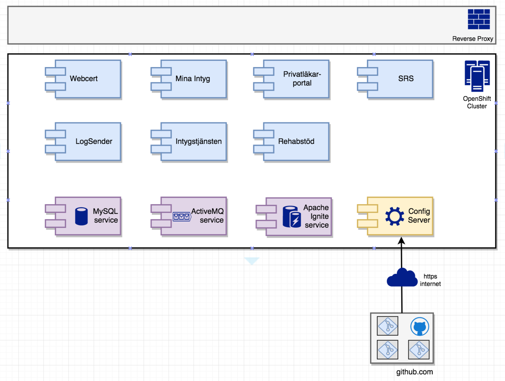
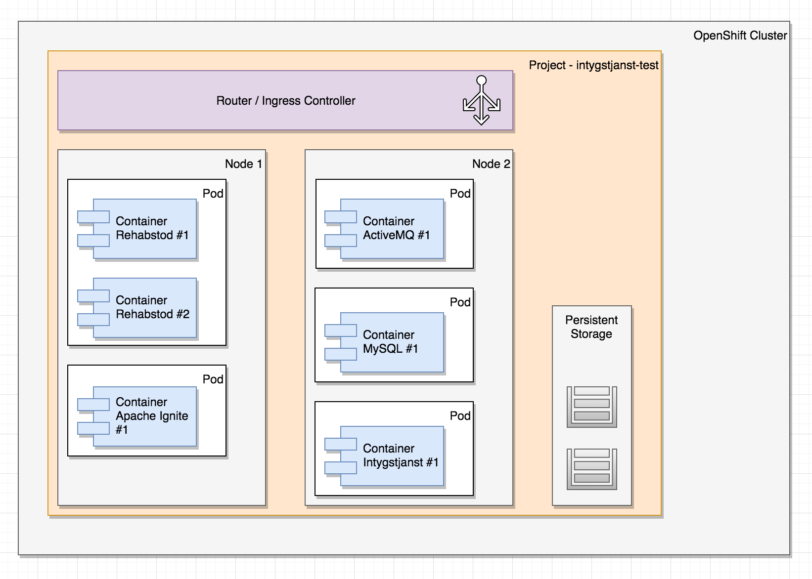

# OpenShift / Intygstjänster
For Intygstjänster 2018 we are evaluating deployment of our applications on an OpenShift cluster. This document provides som work-in-progress thoughts and findings on the topic.

### Overview
Work-in-progress conceptual overview of an OpenShift cluster for test purposes running our applications and supporting services:

Each container should only container web server + .war file and any static resources needed to execute. A container image should be runnable from local dev environment to production, i.e. all environment specifics such as configuration properties, certificates, SAML-metadata, logback-files, dynamic text resources etc must be injected or mounted at runtime.

### OpenShift anatomy
Openshift is a PaaS (Platform as a Service) built on top of the CaaS (Container orchestration as a Service) Kubernetes (K8S). OpenShift and K8S introduces a number of abstractions on top of traditional containers to provide orchestration, routing, resilience, configuration etc.
 

- A cluster is backed by one or more **nodes**. A _node_ is a physical or virtualized OS running a OpenShift master or worker. As developers, we should _never_ have to concern ourselves with actual nodes, this is something NMT or BF will provide and configure for us.
- A cluster always backs at least one **project**. A _project_ is typically declared for a number of related applications and their services in a given environment and provides the basis for multi-tenancy in OpenShift. In intygstjänster, we'll typically declare a _project_ for an environment running our applications such as:
    - test
    - demo
     - perf
     - qa
     - staging
     - prod
- Inside a _project_ we can deploy our applications as declared by a **deployment configuration**, typically defining a _container image_ for the application we want to deploy, number of replicas, ports to expose etc.
- A launched _deployment configuration_ will create a **pod** that may run one or more **containers** for the given _container image_.
- If we want our container(s) within a _pod_ to be visible _within_ the cluster, we need to define a **service** that provides an internal DNS name so our applications can talk to each other. The _service_ abstraction provides internal load-balancing, e.g. if we have one _pod_ running three instances of the _intygstjanst_ container image, requests for the logical service name "intygstjanst" will be load-balanced automatically amongst the three instances.
- If we want a _service_ (for example Webcert) to be accessible from outside of the cluster, we need to declare a **route** connecting the service to the outside world, including a port mapping and possibly an external hostname.

## Minishift on Mac instructions
This folder contains some work-in-progress instructions and notes on how to get OpenShift Origin running using "minishift" on a local virtualbox virtual machine.

Also includes some YAML files for setting up ActiveMQ and MySQL for intyg use.

### Installing
##### 1. Install using homebrew:

    > brew cask install minishift

##### 2. Update using homebrew

    
    > brew cask install --force minishift
    

##### 3. Start with virtualbox:

    > minishift start --vm-driver=virtualbox
    -- Starting local OpenShift cluster using 'virtualbox' hypervisor ...
    -- Minishift VM will be configured with ...
       Memory:    2 GB
       vCPUs :    2
       Disk size: 20 GB
     ........
     OpenShift server started.
     
     The server is accessible via web console at:
         https://192.168.99.100:8443
     
     You are logged in as:
         User:     developer
         Password: <any value>
     
     To login as administrator:
         oc login -u system:admin
         
##### 4. Setup first project

1.) Open web browser at https://192.168.99.100:8443/console/ _(you may need to change your IP)_

2.) Log in user system:admin

3.) Create your first project

Name it _intygstjanster-test_

         
##### 5. Fix oc command
Back to the command-line       
         
    > minishift oc-env
    export PATH="/Users/yourusername/.minishift/cache/oc/v3.6.0:$PATH"
    
    OR
    
    > eval $(minishift oc-env)
    
Run that export:

    > export PATH="/Users/yourusername/.minishift/cache/oc/v3.6.0:$PATH"

##### 6. Log in to oc

    > oc login -u system:admin
    Logged into "https://192.168.99.100:8443" as "system:admin" using existing credentials.
    Using project "myproject".
 
##### 7. Change project and grant root so we can run stuff like mysql and activemq    
    > oc project intygstjanster-test
    > oc adm policy add-scc-to-user anyuid -z default
    

         
## YAML OpenShift templates
Inside the "templates" folder we have some YAML files for setting up:

- Deployment configuration
- Service (e.g. Kubernetes Service abstraction)
- Route (E.g. Kubernetes Ingress Controller)

These files should later be integrated into Ansible playbooks with parameter substitution so we can use Jenkins jobs to provision a whole cluster or individual applications from scratch.

### Installing MySQL as a service

1) In the admin GUI, choose "Import YAML / Json".
2) Copy-paste _deploymentconfig-mysql.sql_ into the textarea.
3) Do the same with _service-mysql.yaml_.
4) Note that the mysql-image contains users and empty databases for all our applications.

### Installing ActiveMQ as a service

1) In the admin GUI, choose "Import YAML / Json".
2) Copy-paste _deploymentconfig-activemq.sql_ into the textarea.
3) Do the same with _service-activemq.yaml_.
4) Do the same with _route-activemq.yaml_.
5) ActiveMQ admin should be reachable on _http://activemq-route-intygstjanster-test.192.168.99.100.nip.io/admin/_

