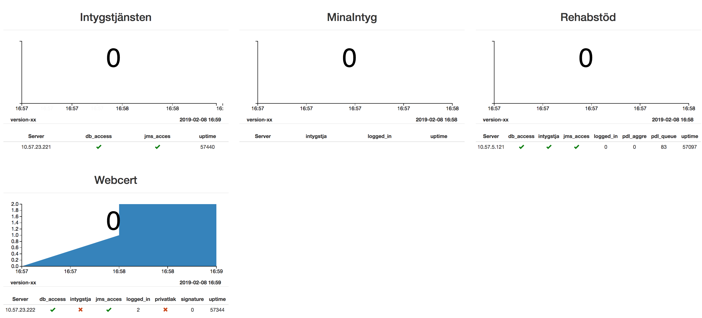
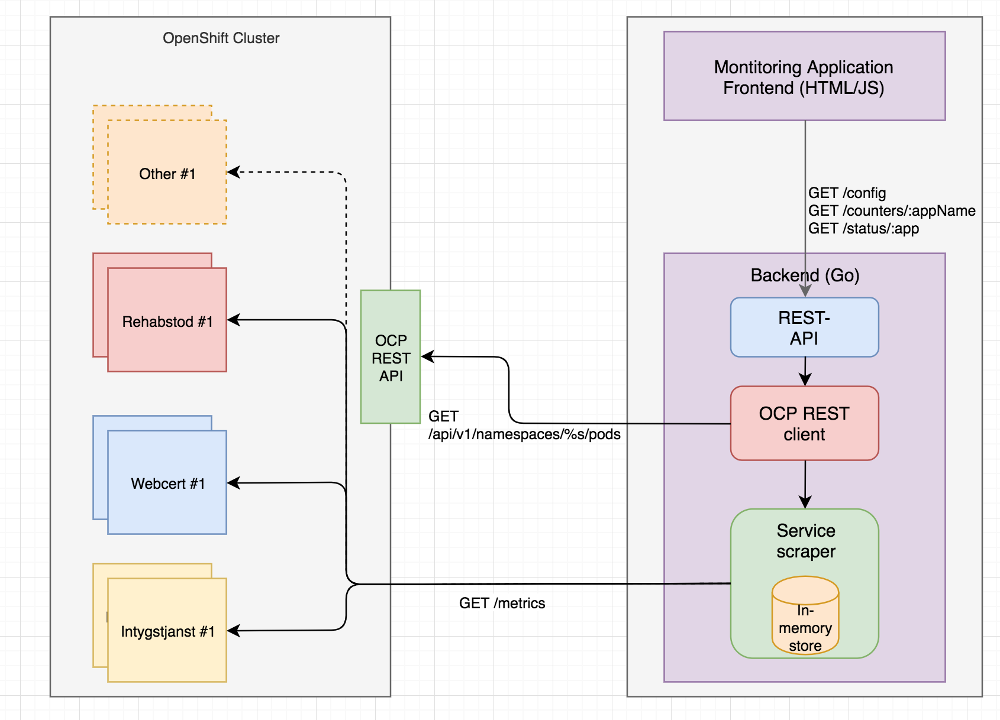

# OCP monitoring
Denna applikation är ett "proof of concept" undertecknad satt ihop på fritiden för att få till motsvarande applikation för monitorering som projektet tidigare hade på https://monitoring.intygstjanster.se .

**OBS!**
_Tanken är inte att ta denna PoC "as is" (den är exempelvis skriven i Go) utan att ta koncepten från PoC:en och göra en implementation i Java/Spring enligt våra vanliga mönster. PoC:en dock fullt körbar och kan väl anses som avsevärt mer lättviktig än en traditionell Java+Spring+Tomcat-applikation._

## Kända buggar
- Summeringen av antal inloggade användare fungerar inte korrekt. Varje podd rapporterar _totalt_ antal användare utifrån räknade sessionsnycklar i Redis. Frontend behöver på något vis summera och hålla reda på hur många poddar som körs totalt per applikation, annars kommer antalet användare som rapporteras vara N användare * antal poddar för applikationen.
- chart.js#69 ger ibland fel "Cannot read property '1' of undefined"
- Anrop till /config verkar ibland inte hanteras korrekt i backend
- Versionsnumret exponeras inte, är just nu hårdkodat till "version-xx". Inför en LABEL i /metrics som _är_ versionsnumret? Scrapa /version.jsp?

### Arkitektur
I container-världen så har inte våra applikationer längre ett känt antal instanser och eller på förhand kända IP-adresser, vilket gör det svårt att givet fast konfiguration monitorera _varje instans_ av en applikation.

Denna applikation löser detta genom att via ett s.k. "service account" ställa frågor till OpenShifts (OCPs) REST-API om tillståndet i klustret, där man givet vissa frågor kan ta reda på vilka poddar som finns och den exakta (interna) IP-adressen för respektive "podd" som kör en given applikation.

När applikationen sedan tagit reda på IP-adress för varje podd så frågar man därefter poddens _/metrics_ endpoint via vanlig HTTP GET för att få tag på motsvarande "health"-information som tidigare publicerades via PingForConfiguration. Varje /metrics endpoint har en eller flera värden med nyckel som prefixas med "health_" vilket vår backend känner till. Dessa värden motsvarar det vi tidigare publicerade via PingForConfiguration eller health-check.jsp

_(Notera att OCP monitoring också körs i OCP-klustret, ritas dock såsom utifrån i bilden ovan för att tydliggöra mekanismera som används)_

När applikationen sedan startats kommmer GUI:t göra anrop mot REST-API:t för att hämta dels _vilka_ applikationer som finns och sedan _counters_ och _status_ precis som den förra versionen gjorde.

GUI:t är baserat på det tidigare GUI:t, men fungerar nu dynamiskt utifrån de applikationer som listas som konfigurerade av _/config_ endpointen - som i sin tur konfigureras utifrån miljövariabler. Se nedan.

## Bygga

PoC:en är byggd med Golang i backend, samt en något modifierad kopia av tidigare monitorerings-applikations frontend (HTML + JS). 

Byggsystemet är baserat på Make, kräver att man har Go 1.11 SDK:n installerad lokalt.

Att bygga själva binären är trivialt.

    > make build
    
Dock så har det begränsad nytta i och med att programmet behöver befinna sig i samma OCP-project som applikationerna, annars kan programmet ej nå de (interna) IP-adresser vars _/metrics_-endpoint som skall scrapas.

Istället är det en Docker-image som skall byggas, där OCP monitoring programmet kompileras för linux-plattformen. Vår Dockerfile:

    FROM iron/base
    EXPOSE 8080
    
    USER 1000:1000
    
    ADD dist/ocpmonitoring-linux-amd64 /
    ADD gui /gui
    
    ENTRYPOINT ["./ocpmonitoring-linux-amd64"]

* Notera bas-imagen "iron/base", byt lämpligen ut denna mot en lämplig RHEL. Go-programmet i sig kräver enbart libc som troligen finns på 99.9% av alla Docker-images.
* Notera USER 1000:1000, detta så OpenShift inte rejectar imagen såsom körande som root.
* Notera ENTRYPOINT-kommandot helt utan argument, detta då programmet helt konfigureras via miljövariabler. Mer om dessa senare i README.

För att bygga en Docker-image, se till att Docker är aktivt lokalt (docker machine, docker for mac etc) och kör _make release_:

    > make release
    mkdir -p dist
    export GO111MODULE=on;export GOOS=linux;export GOARCH=amd64;export CGO_ENABLED=0;go build -o dist/ocpmonitoring-linux-amd64
    export GOOS=darwin
    go build -o dist/ocpmonitoring-darwin-amd64
    docker build -t sklintyg/ocpmonitoring:latest .
    Sending build context to Docker daemon  37.45MB
    Step 1/6 : FROM iron/base
     ---> b438fe7f76e9
    Step 2/6 : EXPOSE 8080
     ---> Using cache
     ---> c2e9e84a48be
    Step 3/6 : USER 1000:1000
     ---> Using cache
     ---> 0fa1f45f9eea
    Step 4/6 : ADD dist/ocpmonitoring-linux-amd64 /
     ---> Using cache
     ---> cfda0cb822d9
    Step 5/6 : ADD gui /gui
     ---> Using cache
     ---> a254dedfb547
    Step 6/6 : ENTRYPOINT ["./ocpmonitoring-linux-amd64"]
     ---> Using cache
     ---> 4aeb907bf2dc
    Successfully built 4aeb907bf2dc
    Successfully tagged sklintyg/ocpmonitoring:latest
    
Detta kommando bygger en linux-binär och paketerar sedan den i en Docker-image "sklintyg/ocpmonitoring" som nu finns _lokalt_ på maskinen.

Denna image går _eventuellt_ att importera in i OpenShift om man vet hur man gör. Men när applikationen testkörts så har den byggda imagen först pushats upp till Docker Hub och sedan importerats därifrån in i "demointyg" via OCPs GUI:

    Add to project -> Deploy image -> Image name.

Imagen kan laddas upp i godtyckligt Docker repo. Förslagsvis Ineras egna image-repo vilket då gör det enkelt för BF att deploya i STAGE / PROD. Exempel (Docker hub) givet att man skapat ett namespace "sklintyg" på Docker Hub:

    docker push sklintyg/ocpmonitoring:latest
    oc import-image sklintyg/ocpmonitoring:latest --confirm

## Konfiguration

Applikationen konfigureras till 100% via miljövariabler där följande OpenShift secret innehåller samtliga. Exempel för "demointyg":

    apiVersion: v1
    stringData:
        OCP_AUTH_TOKEN: 'changeme'
        OCP_SERVER_URL: 'url to BF'
        OCP_PROJECT_NAME: 'demointyg'
        OCP_SCRAPE_TARGETS: 'webcert-demo,rehabstod-demo,intygstjanst-demo,minaintyg-demo'
        OCP_SCRAPE_TARGETS_LABELS: 'webcert-demo=Webcert,rehabstod-demo=Rehabstöd,intygstjanst-demo=Intygstjänsten,minaintyg-demo=MinaIntyg'
        OCP_SCRAPE_TARGETS_CONTEXT_PATH: 'intygstjanst-demo=/inera-certificate'
    kind: Secret
    metadata:
      name: ocpmonitoring-demo-secret-envvar
    type: Opaque
    
- OCP_AUTH_TOKEN: Här skall en API auth token anges. För egen användare kan man få tag på en sådan via "oc whoami -t", men för mer permanenta ändamål skall ett "service account" skapas med läsrättigheter, vars API TOKEN sedan kan anges här.
- OCP_SERVER_URL: Pekar på antingen test- eller prod-klustret.
- OCP_PROJECT_NAME: Skall vara project-namnet vars applikationer skall monitoreras. demointyg, sintyg eller pintyg.
- OCP_SCRAPE_TARGETS: Exakta namnet på respektive "deployment configuration" för respektive applikation. För stage/prod, ta alltså bort "-demo".
- OCP_SCRAPE_TARGETS_LABELS: Key-value par där respektive nyckel skall matcha ett scrape-target enligt ovan och värdet är det namn applikationen får i GUI:t.
- OCP_SCRAPE_TARGETS_CONTEXT_PATH: Här kan man för ett scrape-target ange en alternativ context-path. Används så att intygstjänstens _/inera-certificate_ kan hanteras.

För "demointyg" finns en secret ovanstående i filen [envvar-secret.yaml](envvar-secret.yaml). Denna kan alltså installeras i OCP, justera namnet beroende på miljö. Att vi hanterar denna som en secret och inte en config-map beror på att API_TOKEN skall skyddas.

    oc create -f envvar-secret.yaml
    
## Frontend
När applikationen väl deployats på OCP med erforderlig konfiguration så ligger dess GUI på kontext-rooten. GUI:t är i grunden samma som tidigare GUI, men har anpassats så den nyttjar _/config_ endpointen för att läsa upp vilka applikationer den skall visa information för.